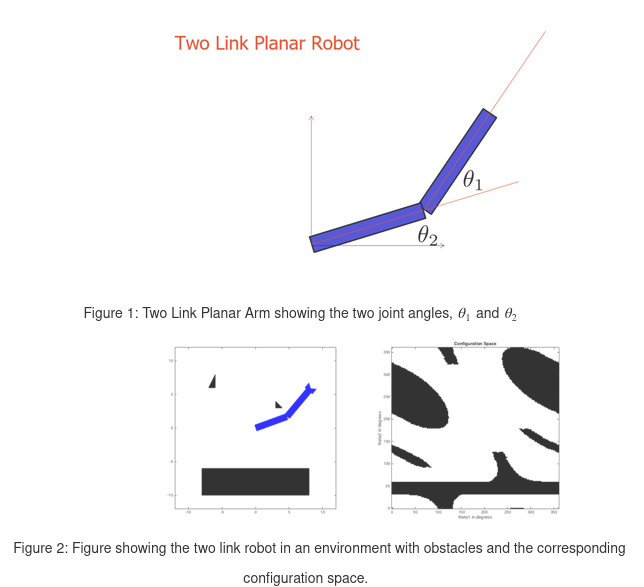
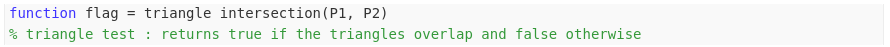

# Configuration Space

## Configuration Space
The goal of this assigment is to guide the two link robot arm shown in the figure below from one configuration to another while avoiding the obstacles in the workspace. In this example, the configuration of the robot and is capture by the two joint angles, $\theta_1$ and $\theta_3$. In the code, these are represented in deggres with values in [0, 360]. The graph of the left of Figure 2 shows a depiction of the robot and the workspace obstacles while the graph on the right shows the corresponding configuration space obstacles. The horizontal and vertical axes in this second figure correspond to $\theta_1$ and $\theta_2$ respectively. Looking carefully on the figure on the left it can be noted that both the robot and the obstacle are represented by a collection of triangles. This decomposition helps us to decide whether a particular robot configuration would lead to a collition by checking whether any of the triangles in the robot intersect any of the obstacle triangles. 
  

The function triangle intersection has the following function signature 
 
### Input format
- *P1, P2*: a 3x2 array (each), describing the vertices of a triangle, the first column correspond to the x coordinates while the second column to the y coordinates.
### Output format
- *flag*: Return value for the function, set to true if it determines that the triangles do intersect and false otherwise.

## Dijkstra on torus
This code works similar to the DijkstraGrid code written in the last week. The only real difference is that we have to keep in mind the fact that in this configuration space the two parameters, $\theta_1$ and $\theta_2$, correspond to angles so when considering the neighbors of each cell needs to keep in mind that the angles wraparound in both dimensionsgiving the configuration space the topology of a torus. 

You can test the function by running the last two cells in the supplied script file TwoLinkCSpace which plots a path through the configuration space using DijkstraTorus and then animates this path. You should experiment with choosing different start and end coordinates. 
