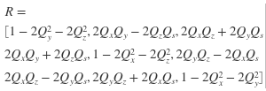

# Convert a quaternion to a rotation matrix

Convert the given quaternion to a rotation matrix. 

 

### Input format
- quat will be a unit quaternion represented by a 1x4 matrix of the form [Qs, Qx, Qy, Qz]
- [Qs, Qx, Qy, Qz] is the matrix equivalent of the quaternion Qs + Qx i + Qy j + Qz k

### Output format
- R must be a valid 3x3 rotation matrix
