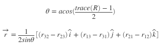
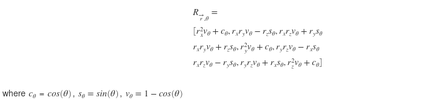

# Convert a given rotation matrix to axis-angle representation

This script converts the rotation matrix R into axis-angle form. 
The general form of the equation is:
 

However, it can be seen that the above equation for r is not valid when sin(theta)=0. This are the singularity cases at theta=0, theta=pi and theta=-pi which need to be handeled separately. When theta = 0, we have infinite solutions, as it represents no rotation. So r can be any arbitrary vector. 
The below equation should be useful when theta=pi.
 

A rotation matrix can have two sets of solutions:
- (vec, theta) or (-vec,-theta). These solutions are equivalent.
- In this task only theta in [0,pi] is tested.

### Singularities
Two singularities cases:
- theta = 0 represents no rotation, and there are infinite solution for this. So vec must be [NaN NaN NaN] in this case.
- theta = pi has two equivalent solutions. In this case, vec must be 2x3 matrix containing both solutions.
- For all other cases, vex will be 1x3 matrix containing a single solution.

### Input format
- R will be a valid 3x3 rotation matrix with det(R) = 1

### Output format
- vec will be a 1x3 matrix containing a single solution if only one solution exists in [0, pi]
- vec will be a 2x3 matrix containing two solutions if two solutions exist in [0, pi]
- vec will be a 1x3 matrix of the form [NaN NaN NaN] if infinite solutions exist in [0, pi]
- Every row in vec is of the form [x y z] if the vector is xi + yj + zk
- theta is always a 1x1 matrix, and in radians
- The final output is then to be stored in 'axang' as a 1x4 or 2x4 matrix where each row is of the form [x y z theta]

