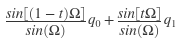
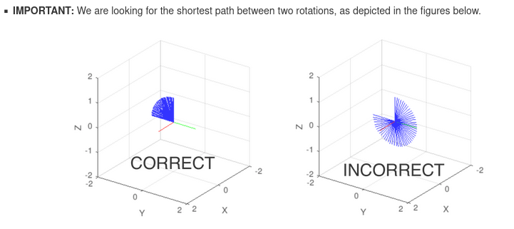

# SLERP

The script animation.m makes use of the function in quat_slerp.m to perform SLERP between two quaternions. All quaternions are represented as [Qs Qx Qy Qz].

### Input format
- q0 is the unit quaternion representing the starting orientation, 1x4 matrix
- q1 is the unit quaternion representing the final orientation, 1x4 matrix
- steps is the number of required quaternions to be returned, integer value

### Output format
- The fisrt step is q0 and the last step is q1
- q_int contains q0, steps-2 intermediate quaternions, q1 in the order of ascending order of timesteps
- q_int is a (steps x 4) matrix

Since the quaternions are unit quaternions, we can find the angle between them using dot product:
$$
cos(\Omega) = q_0\cdot q_1
$$
At time step t, the intermediate quaternion is given as: 
 

