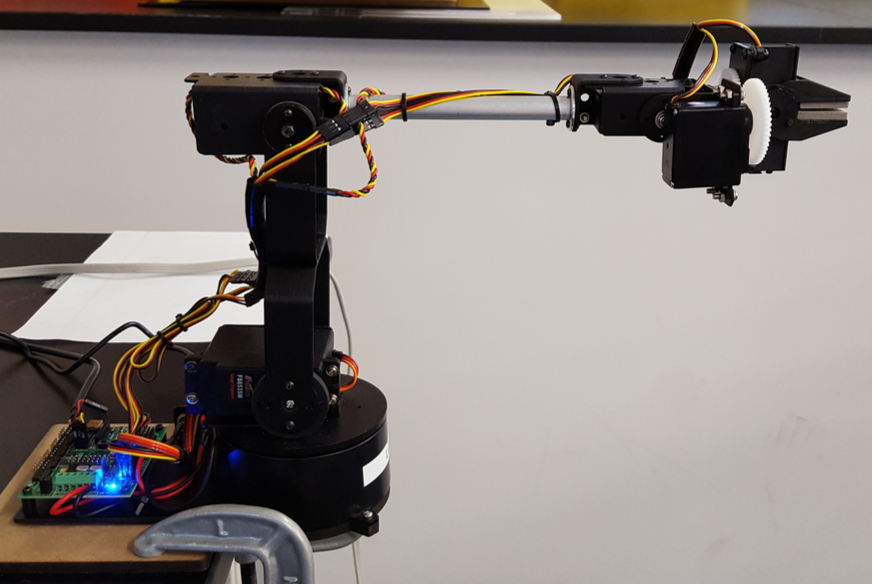

# Forward Kinematics of a Lynx Robot

The function lynx_fk returns the position of 10 points along the robot arm as defined later, given the joint angles of the robot. 
 

 

### Input format
- $\theta_1, \cdots, \theta_5$ are the joint angles in radians, as shown in the figure

### Output format
- pos is a 10x3 matrix where each row contains the x,y,z coordinates represented as [x y z] in matriz form
- Each row is the x,y,z coordinates of a point in world frame (frame 0)
- The first 5 rows contain:
	- Position of frame 0 in world frame
	- Position of frame 1 in world frame
	- Position of frame 2 in world frame
	- Position of frame 3 in world frame
	- Position of frame 4 in world frame
- The next 5 rows are used to describe the gripper (green dots shown in the figure above)
	- [0 0 -e] of frame 5 in world frame
	- [g/2 0 -e] of frame 5 in world frame
	- [-g/2 0 -e] of frame 5 in world frame
	- [g/2 0 0] of frame 5 in world frame
	- [-g/2 0 0] of frame 5 in world frame
