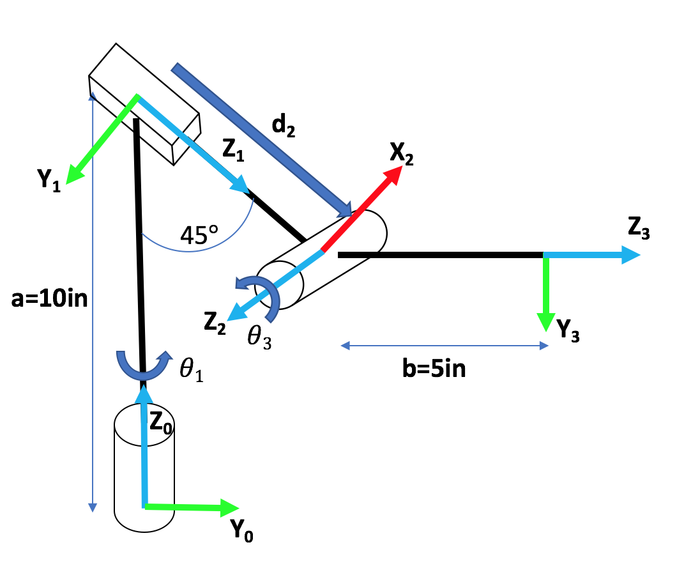

# PRP Robot configuration: Forward and Inverse Kinematics

## Forward kinematics
The RPR_fk function returns the position of 4 points along the robot arm as defined later, given the joint angles and the joint extensions of the robot. 

### Input format
- $\theta_1$, $\theta_3$ are the joint angles in radians as shown in the figure.
- $d_2$ is the extension of the prismatic joint in inches, as shown in the figure.

### Output format
- R is a 3x3 rotation matrix representing $R_{03}$ (Note: $P^0=R_{03}P^3$ where $P^x$ represents a point in frame $x$).
- pos is a 4x3 matrix where each row contains the x,y,z coordinates in world frame (frame 0) represented as [x y z] in matrix form.
- The first rows are in the following order:
	- Position of frame 0 in world frame
	- Position of frame 1 in world frame
	- Position of frame 2 in world frame
	- Position of frame 3 (the end effector) in world frame
	
## Inverse kinematics
The RPR_ik function returns the joint angles and joint extensions of the robot given the position of the end effector and the rotation matrix $R_{03}$. There may be multiple possible joint configurations which lead to the same end effector position. Any solution is accepted. If no solution exists an empty matrix is returned.

### Input format:
- x, y, z: The cartesian coordinates of the end effector in world frame (frame 0).
- R: A 3x3 rotation matrix representing $R_{03}$.

### Output format
- $\theta_1$ the joint angle in radians.
- $d_2$ the extension of the prismatic joint in inches.
- $\theta_3$ the joint angle in radians.
