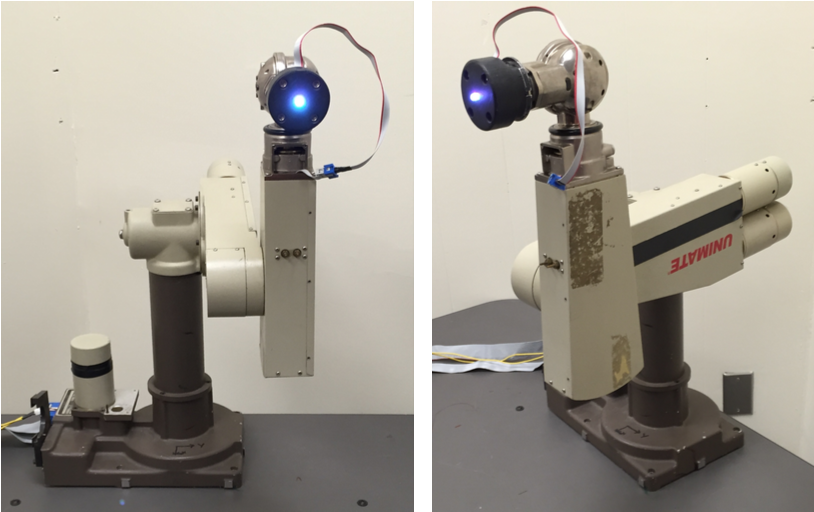

# Jacobians and Manipulabillity

## Linear and Angular Velocities of a Lynx
The function lynx_velocities computes the linear ang angular velocities of the end effector of the robot shown in fugure. 
 
For this, the forward kinematics must be solved first based on the next diagram. 

### Input format
- thetas: $[\theta_1, \cdots, \theta_5]$ are the joint angles in radian.
- thetadot: $[\dot{\theta}_1, \cdots, \dot{\theta}_5]$ are the rate of change of joint angles in radian/sec

### Output format
- v06: linear velocities of the end effector (origin of frame 5), expressed in frame 0. 1x3 matrix where each row contains the x,y,z components of the velocity represented as [x y z] in matrix form.
- w06: Angular velocity of the end effector (origin of frame 5) with respect to frame 0, expressed in frame 0. 1x3 matrix where each row contains the x,y,z components of the velocity represented as [x y z] in matrix form.

## Linear and Angular Velocities of a PUMA
The function puma_velocities compute the linear ang angular velocities of the end effector of the robot. Here is what a real PUMA looks like: 
 
For this, the forward kinematics must be solved first based on the next diagram. 

### Input format
- thetas: $[\theta_1, \cdots, \theta_5] are the joint angles in radian.
- thetadot: $[\dot{\theta_1}, \cdots, \dot{\theta}_6]$ are the rate of change of joint angles in rad/sec.

### Output format
- v06: linear velocities of the end effector (origin of frame 6), expressed in frame 0. 1x3 matrix where each row contains the x,y,z components of the velocity represented as [x y z] in matrix form.
- w06: Angular velocity of the end effector (origin of frame 6) with respect to frame 0, expressed in frame 0. 1x3 matrix where each row contains the x,y,z components of the velocity represented as [x y z] in matrix form.
