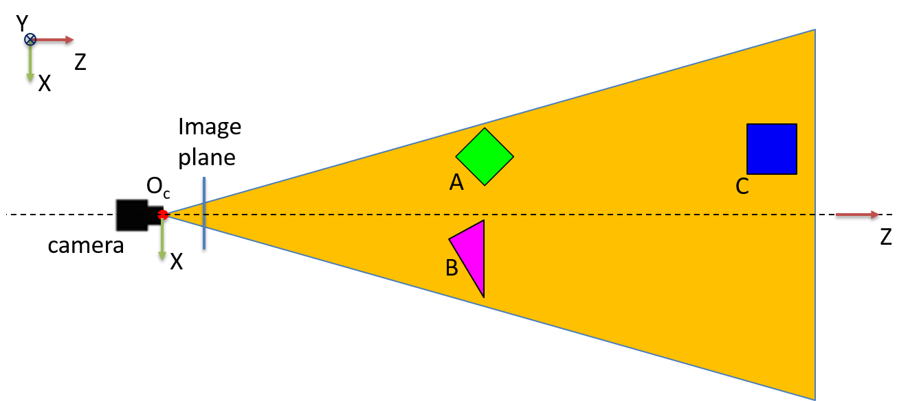
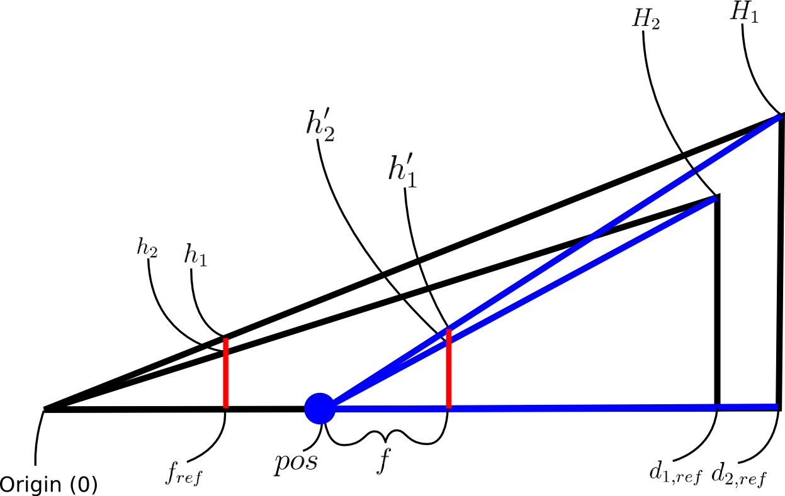
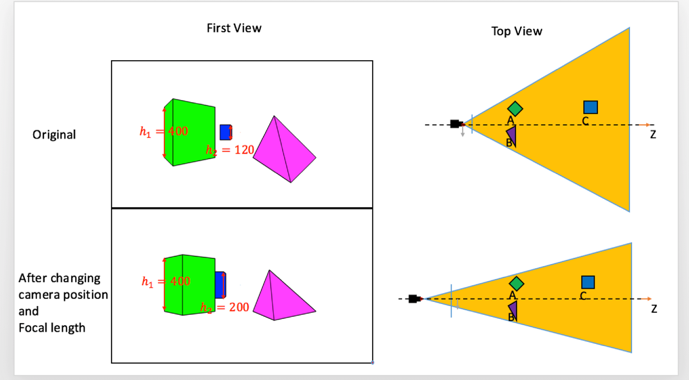

# Dolly Zoom

The Dolly Zoom effect is used by film makers to create a sensation of vertigo, a "falling-away-from-oneself-felling". It keeps the size of an object of interest constant in the image, while making the foreground and backgroud objects appear larger or smaller by adjusting focal length and moving the camera. The Dolly Zoom effect is simulated is here simulated with a synthetic scene as shown in the next figure, which illustrates two cubes and one pyramid seen from the top view. 
 

A point in 3D is projected onto the image plane through the pinhole (cneter of projection, COP): 
$$
u = f\fracc{X}{Z}
$$
$$
v = f\fracc{Y}{Z}
$$

where $(u,v)$ is the image coordinate of the projection, $(X,Y,Z)$ is the 3D point, and $f$ is the focal length of the camera. When the camera moves along with its Z-axis, the depth, $Z$, changes and therefore, the projection, $(u,v)$, changes. In our particular case the $Z$ of interest is $d_{ref}$ the depth of the objects in the scene. In the following discussion we will only mention the $u$ coordinate to simplify the equations, as we are focused mainly on hight for the dolly zoom. This projection change produced by the depth change can be compensated by adjusting the focal length: 
$$
u = f_{ref} \fracc{X}{d_{ref}} = f' \fracc{X}{d_{ref} - pos}
$$

where $pos$ is the movement of the camera along its $Z$ axis (+ direction indicates approaching to objects) and $f'$ is the modified focal length, $f_{ref}$ and $d_{ref}$ are the focal length and pedth of an object in the original image, respectively. Dolly Zoom effect exploits the compensation between depth and focal length, which produces depth sensation. The relationship between all the variable names as given in the code is described in the nextx figure. 
 

The next figure illustrates the focal length/depth compensation: the camera moves away from the object while changing its focal length such that the height of the object A, $h_1=400$, in both original and moved images remains constant. Note that the heights of the other background objects are changed due to its effect. 
 

The function *compute_focal_length* estimates the modified focal length $f'$, given the depth of the object of interest $d_{ref}$ and the focal length $f_{ref}$, such that the height of the object remains constant as the camera moves in the Z-axis (different input $pos$ values). 

The function *compute_f_pos* estimates the modified focal length $f'$ such that the ratio of the heights of the two objects in the image $h1/h2$ is the same as the input value $ratio$, while the height $h1$ of the first object remains constant. The given values to the function are the distances of two objects $(d_{1,ref}, d_{2,ref})$ and their corresponding heights in the physical world ($H1$ and $H2$ respectively), a specified focal length $f_{ref}$ and the value $ratio$.
