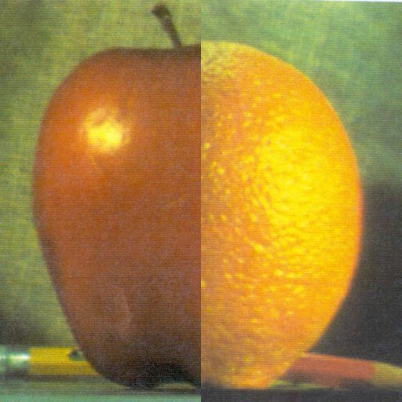

# Laplacian Blending

The Laplacian pyramid algorithm for blending is used on the iconic example from the paper of Burt and Anderson. Below, you can look the two images we want to blend. 
 { width: 200px; } 

If we crop the left part of an image and the right part of the other and attempt to merge them we will get a mediocre result: 
 
This implementation applies a multi-scale blending based on Laplacian pyramids, that will give more realistic outputs, like the one below: 

## Reduce and Expand Operations
The basic building blocks used by the Gaussian and Laplacian pyramid are the *reduce* and *expand* operations. 
For the *reduce* function a filter to the image is applied with a Gaussian kernel of size $5\times 5$ and then the image is subsampled by a factor of 2.

### Input format
- I: The input image.

### Output format
- g: The image after Gaussian blurring and subsampling

For the *expand* function an image that has twice the size of the original image is created and every second row and column of this new image is filled with the rows and columns of the original image, then a filter with the same Gaussian kernel is applied to the new image.

### Input format
- I: The input image.

### Output format
- g: The image after the expand operation

## Gaussian pyramid
The function *gausspyr* returns the levels of the Gaussian pyramid given an image and the number of levels.

### Input format
- I: The input image.
- depth: Number of levels of the Gaussian pyramid.

### Output format
- G: A cell containing all the levels of the Gaussian pyramid.

## Laplacian Pyramid
Every level in a Laplacian pyramid comes from taking the same level of the Gaussian pyramid and substracting the expanded version of the next level. The only exeption is the last level which is the same as the last level of the Gaussian pyramid. In the *laplacianpyr* function makes use of the *gausspyr*, *expand* and *reduce* functions.

### Input format
- I: The input image.
- depth: Number of levels of the Laplacian pyramid.

### Output format
- G: A cell containing all the levels of the Laplacian pyramid.

## Combine Pyramids
The function *combine* creates a combined pyramid $LS$ from the two pyramids $LA$ and $LB$ using the nodes $GR$ as weights. Effectively, for every level $d$ of the pyramid, and every pixel $(i,j)$, the given pyramid will be given by:
$$
	LS(d,i,j) = GR(d,i,j) * LA(d,i,j) + (1 - GR(d,i,j)) * LB(d,i,j)
$$

### Input format
- LA: The Laplacian pyramid of the first image
- LB: The Laplacian pyramid of the second image
- GR: Gaussian pyramid of the selected region

### Output format
- LS: Combined Laplacian pyramid

## Collapse Pyramid
The image output comes from collapsing the Laplacian pyramid of the blended image. For that, the reverse operation to compute the Laplacian pyramid must be followed. Starting from the last level of the Laplacian pyramid we take the expanded version of it and added to the image of the previous level. Then we expand this output and added to the previous level, until we erach the first level. The *collapse* function follows these steps.

### Input format
- L: The Laplacian pyramid of an image
### Output format
- I: Recovered image from the Laplacian pyramid

You can use the blending.m to run the complete Laplacian Blending algorithm.
