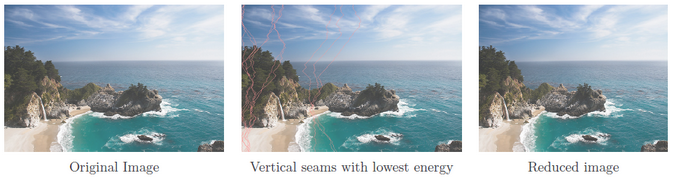

# Image Carving
 This lab focus on the concept of image resizing utilizing the principals supporting minimum-energy seam carving and dynimic programming. The goal of this part is resizing images while attempting to preserve the integrity of important image information. 
This lab shrinks an image (making is smaller), by sequentially removing vertical seams of vertical minimum energy. 
 
We begin by computing the energy map by 
$$
	E = |\partial I/ \partial x| + |\partial I / \partial y|
$$

The image shrinking is achieved by sequentially removing vertical seams of minimum cumulative energy $E$. The optimal vertical seam (in the sense of minimum cumulative energy) can be found using dynamic programming. The first step is to traverse the image from the second row to the last row and compute the cumulative minimum energy $M_x$ for all possible connected seams for each entry $(i,j)$:
$$
	M_x(i,j) = E(i,j) + min\{ M_x(i-1, j-1), M_x(i-1, j), M_x(i-1, j+1)\}
$$

At the end of this process, the minimum value of the last row in $M_x$ indicates the end of the minimal connected vertical seam. Note that you have to record a backtrack table along the way. Hence, in the second step we backtrack from this minimum entry on $M_x$ to find the path of the optimal seam. Also, in order to maintain consistency, if the minimum value is found at multiple indices, we choose the smaller index. Finally, this process is iterated several times, as many as indicated by the input argument $N$.
