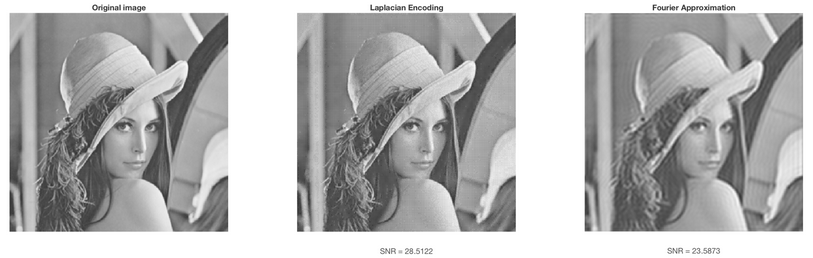

# Laplacian Pyramid for Image Encoding

In this project, the Laplacian pyramid algorithm is used for image encoding/compression. 
The motivation behind this application, lies in the fact that the Laplacian pyramid stores image differences at high resolution which are quite predictable, in the sense that the variety of the values is pretty small, with most pixels being concentrated arround zero. To capitalize on that, it was proposed by Burt and Adelson to encode these values in a more compact representation, by quantitizing the values, requiring essentially less bits of information to represent each one of those. This is relevant to the image Approximation of the second lab, where we were able to compress the image by cutting the high frequencies of the image and storing a low frequency representation. Here the motivation is the same, since we again attempt to compress the image, however the approach is different, where we do not necessarily cut down the high frequency, so details of the image can still be visible. In the result below, we attempt to compress the image with the two techniques, for approximetely the same compress ratio. 
 

## Part 1
For the first part of the project a quantification of the values of the images (the difference and the low resolution blurred version) stored in the Laplacian pyramid using uniform quantization. While for most images, we assume that the pixel values lie in the interval [0, 255], here we will assume only a small discrete set of these values are available, e.g. {0, 63, 127, 191, 255}, and each pixel will be assigned a value from this descrete set only. Since we limit ourselves on this small set, we lose some accuracy in our values, but we need much less space to represent the values at each pixel. In the above example, each pixel can take ony one of the 5 values, instead of the 256 values that are originally available. 

The function *encoding* takes as input a Laplacian pyramide and encodes it by uniformly quantitizing the values of the pixels for the different images.

### Input format
- L: The Laplacian pyramid of the input image
- bins: The number of bins used for discretization of each pyramid level
### Output format
- LC: The quantized version of the image stored in the Laplacian pyramid

## Part 2
The function *pyramident* computes the entropy for an encoded Laplacian pyramid provided. The entropy of an image is a statistical measure that quantifies the last number of bits required to represent each pixel in the image. If an image has low estropy, then we need less bits to represent it (as in the example of the previous step).

### Input format
- LC: the quantized version of the images stored in the Laplacian pyramid
### Output format
- ent: the bitrate for the image given the quantization

## Part 3
Using the image example of the first step, we will connect the implementation of the last labs to compress the image with the Laplacian encoding. For a comparison, we will also leverage code from the second lab, and approximate the using Fourier trasform. We will attempt to keep approximately the same compression rate for this technique, such that we need the same number of bits for each image, using the function *Laplacian_encoding.m*.
