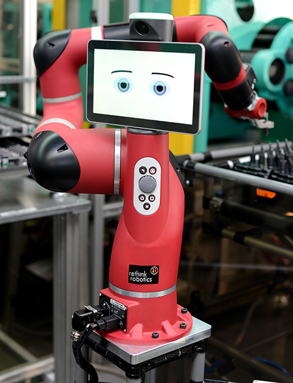
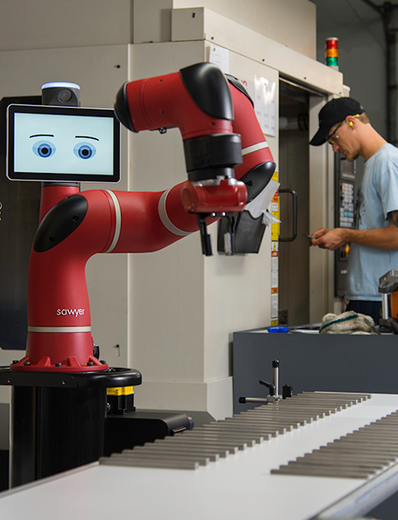
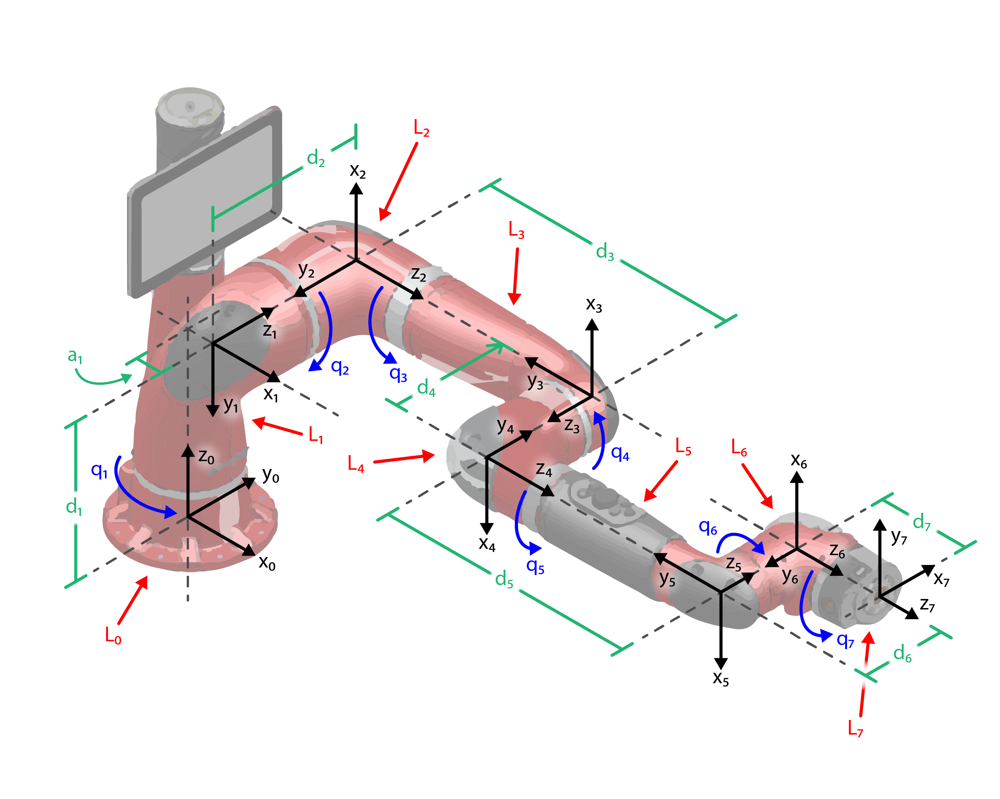

# Modelling of a Robot Arm

In this project the Euler-Lagrange equations of motion are derived for Sawyer, a state of the art 7 degree of freedom robotic arm developed by Rethink Robotics shown below in figure 1. 
 
 
Figure 1: Sawyer, a 7 degree of freedom robotic manipulator from Rethink Robotics (Pictues: rethinkrobotics.com) 

The coordinate frames, dimensions and generalized coordinates are shown below in Figure 2. 
 
Figure 2: Sawyer coordinate frames with link labels in red, dimensions in green, and generalized coordinates in blue.
