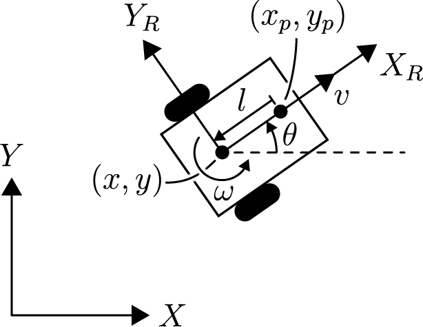
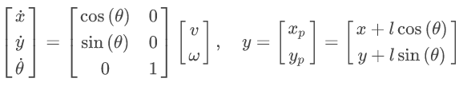
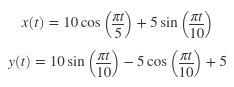

# Trajectory Tracking with a Mobile Robot

Suppose you are tasked with devising a robotic system that can paint patterns on athletic fields and roadways. The chosen platform is a differentially driven robot with a paint sprayer mounted a distance of $l$ from the center of rotation along the $X_R$ axis as shown below in Figure 1: 
 

Considering $v$ and $\omega$ as the control inputs to the system, the nonlinear state space equations are given by: 
 
where $(x,y,\theta)$ is the position of the robot and $(x_p, y_p)$ is the position of the paint sprayer.

## Controller Design
Givern the problem statement above, this project implements a control law to drive the robot such that the locations of the paint sprayer follows the trajectory given below: 
 
described by the following set of parametric equations: 
 
The painting mechanism is programmed to begin spraying at $t_s = 2.5s$ and stop at $t_f = 18s$. During that period, the position of the sprayer $(x_p, y_p)$, remains within $0.15m$ of the desired path. 
