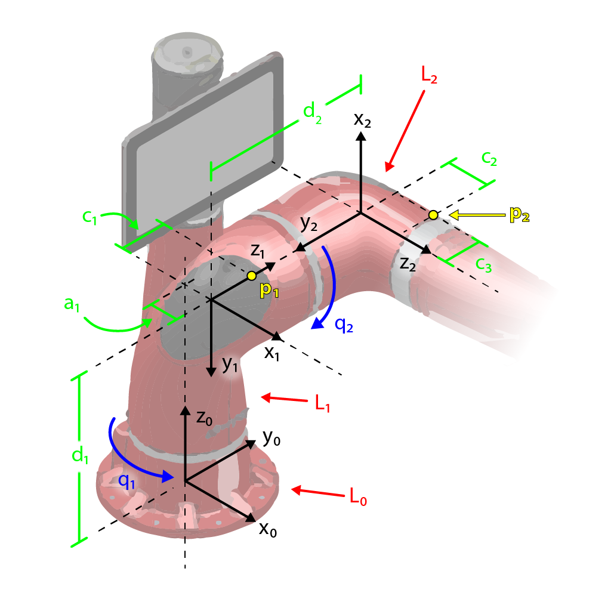

# Introduction

 
Figure 1: the first three links of Sawyer, a robotic manipulator. Link labels are in red, joint angles are in blue, and dimensions are in green. Following the Denavit-Hartenberg convention, coordinate frames have been attached to each link. $P_1$ is located on link 1 along $z_1$ and $P_2$ is located on link 2 in the $y_2z_2$ plane.

## Homogeneous Transformations

### Rotation Matrices
Given the first three links of Sawyer in Figure 1, the script *rotation.m* determines the following rotation matrices: $R_1^0$, $R_2^1$ and $R_2^0$ (Note: subscripts represent the source frame and superscripts represent the destination frame).

### Homogeneous Transformations
Given the first three links of Sawyer in Figure 1, the script *homogeneous_transform.m* determines the following homogeneous transformations: $T_1^0$, $T_2^1$ and $T_2^0$.

### Inverse Homogeneous Transformations
Given the first three links of Sawyer in Figure 1, the script *inv_homogeneous_transform.m* determines the following homogeneous transformation: $T_0^2$.

## Velocity and Acceleration of a Rigid Body

### Velocity of Points on a Rigid Body
Given the robot configuration shown in Figure 1 and joint velocities $\dot{q} = [\dot{q}_1, \dot{q}_2, \cdots, \dot{q}_n]^\top$, the script *velocities.m* determines the velocity of points $P_1$ and $P_2$ with respect to the inertial frame $(O_0x_0y_0z_0)$. The resulting velocities are symbolic column vectors in terms of the given dimensions, joint angles, and joint velocities.
