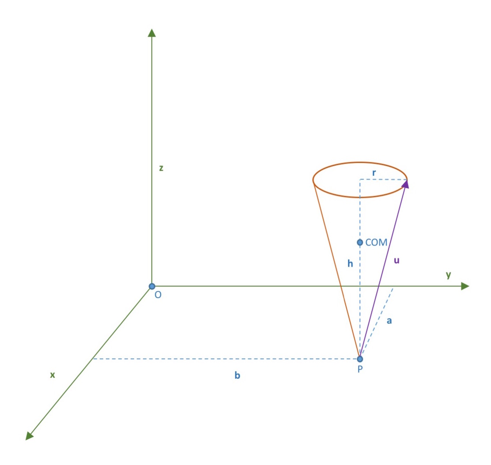

# Rigid Body Dynamics

## Newton's Equations of Motion
Depicted below is a cone of mass $m$ whose center of mass $COM$ is in coordinates $(a,b,\fracc{3h}{4})$. 
 
The script *inertia_p.m* generates the inertia tensor of the cone about the point $P$, $Ip$, using symbolic expressions. The difference between the inertia tensor about point $P$ and the inertia tensor about the center of mass, that is $Idiff = Icom-Ip$, is computed in the script *inertia_com.m* using symbolic functions. Finally, the script *inertia_origin.m* computes the difference between the inertia tensor about point $P$ and the inertia tensor about the origin, that is $Idiff = Io - Ip$
