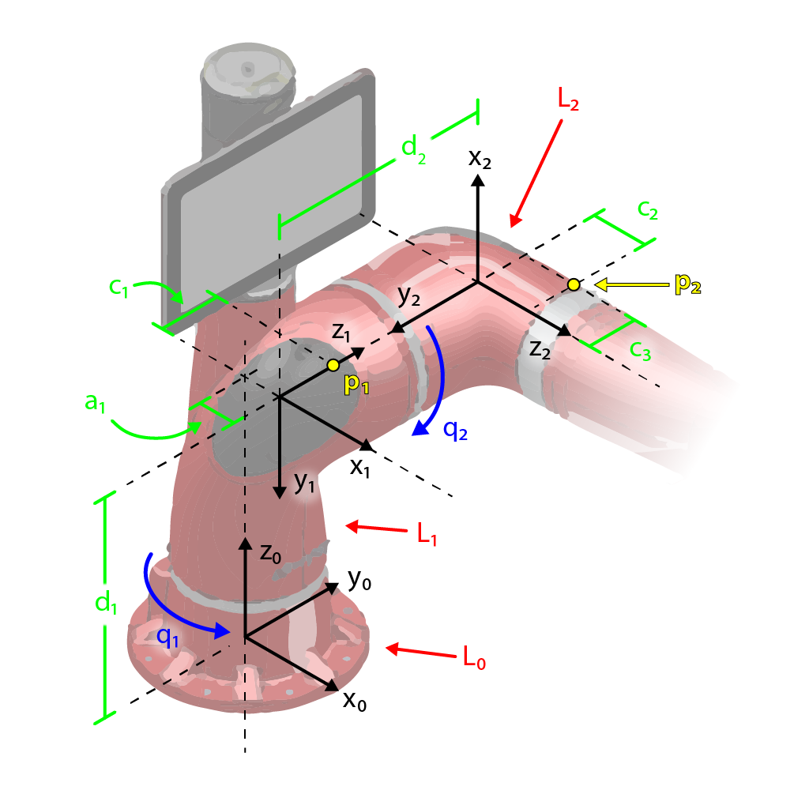

# Dynamics of Robot Arms

## Lagrange's Equations of Motion
 
Figure 1: the first two links of Sawyer with coordinate frames in black, link labels in red, dimensions in green, and generalized coordinates in blue. 

In this lab, Lagrange's equations of motion for the two first links of Sawyer shown in the figure above. Specifically, using homogeneous transformations, the linear and angular velocity Jacobians as well as the kinetic and potential energy. In matrix form, Lagrange's equations of motion can be expressed as:
$$
	D(q)\ddot{q} + C(q, \dot{q})\dot{q} + g(q) = \tau
$$
where $D(q)$ is the inertia matrix, $C(q, \dot{q})$ is the matrix of coriolis and centrifugal forces.

### Linear and Angualr Velocity Jacobians
The first step towards finding Lagrange's equations of motion is to derive the linear and angular velocity Jacobians. This is done in the script *jacobians.m*.

### Kinetic and Potential Energy
With the angualr and linear velocity Jacobiansin hand, the next step towards finding Lagrange's equations of motion is deriving the inertia matrix and kinetic and potential energy of the system. This is done in the script *energy.m*.

### The matrix of Coriolis and centrifugal forces, C
The script *coriolis.m* computes the matrix of Coriolis and centrifugal forces, $C$, shown in the matrix form of Lagrange's equations of motion.

### Lagrange's Equations of Motion
The script *lagrange_EOM.m* derives the Lagrange's equations of motion in terms of the generalized forces, $\tau$.
