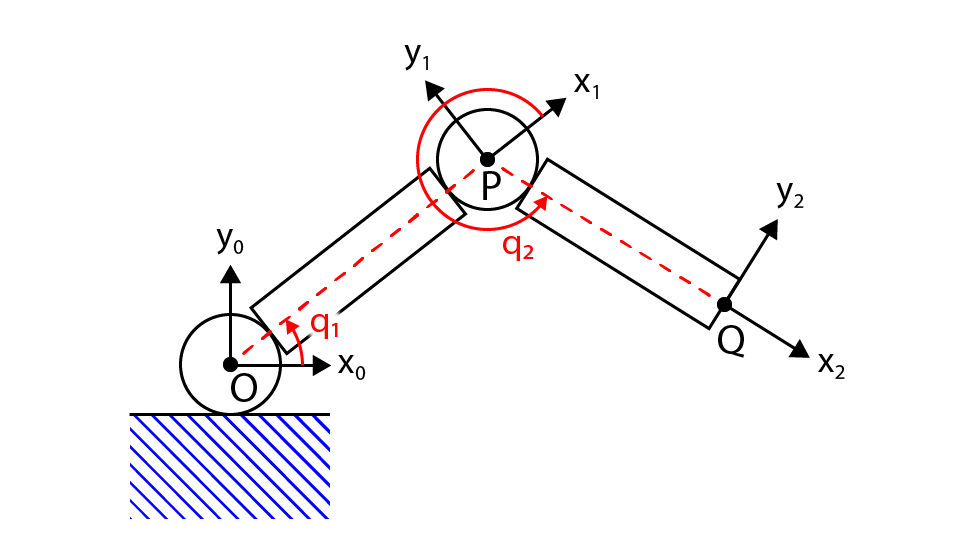
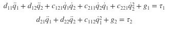
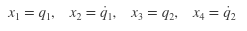
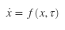

# State Space Modelling and Multivariable Systems

 
Figure 1: a two link planar manipulator 

The following set of differential equations captures the dynamics of the planar elbow manipulator shown above in Figure 1. 
 
 In the script *state_space_arm.m* the system is converted into a state-space representation by intodicing the state variables: 
  
 And finding a matrix, $f(x, \tau)$ such that: 
 
