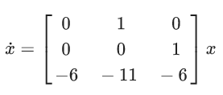
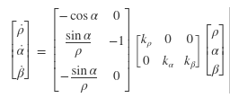
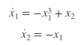

# Stability Theory

## Introduction to Stability
Suppose a system can be described as: 
 
the solution of the system of differential equations, if at $t=0$ the system has an initial value of $x = [1\ 2\ -1]^{\top}$, can be found in the script *stab.m*.

## Stability Analysis of a Nonlinear System
Given the following nonlinear system: 
 
which has an equilibrium point at the origin: $[\rho\ \alpha\ \beta]^{\top} = [0\ 0\ 0]^{\top}$. The script in *nonlin_sys.m* linearizes the system about the equilibrium point and determines a set of gains $K = [K_{\rho}\ K_{\alpha}\ K_{\beta}]$ that stabily drive the system to the origin.

## Lyapunov Direct Method
For the following system: 
 
the script in *lyapunov.m* shows a valid Lyapunov function candidate $(V(x))$ and determines the stability characteristics of the systema at the origin using Lyapunov's direct method (i.e. compute $\dot{V}(x)$).
