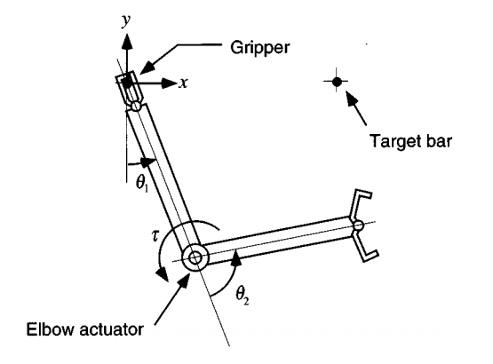
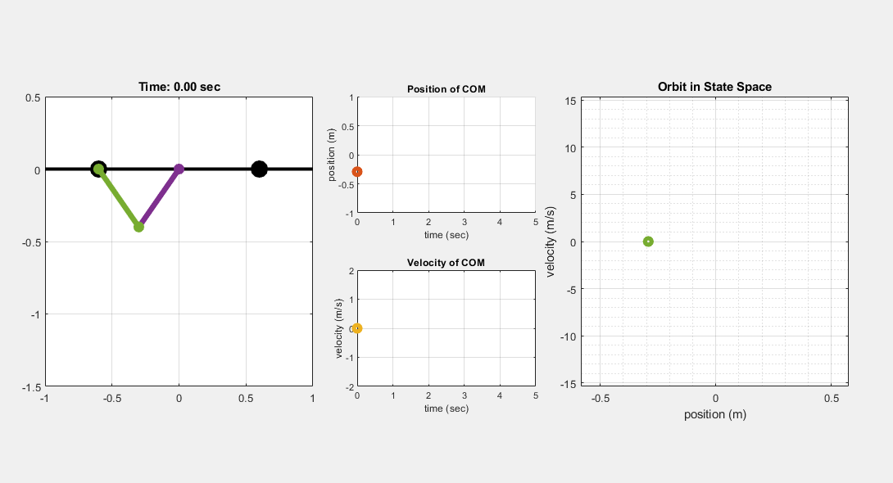

# A Branchiating Robot

## Double Pendulum Dynamics
 
This lab will be focused on emulating a simplified version of arboreal locomotion called brachiation or arm swinging, often seen utilized by primates. This lab outlines work done by Nakanishi, Fukuda and Koditschek. In this lab, we will be taking a look at the double-pendulum, also called a "series revolute-revolute" kinematic chain. One of the takeaways from this will be just how much more complexity is added with each degree of freedom - in the single pendulum case, we already have to linearize the dynamics to make the problem more tractable, and now by just adding a second degree of freedom, you'll find the that the dynamics become much more complex.

Run the [brachiatingRobot](brachiatingRobot.m) script in Matlab to see the results. Note that we are only interested in the free gripper to reach the Target bar since it is supposed to take it when reached and start the process again.

