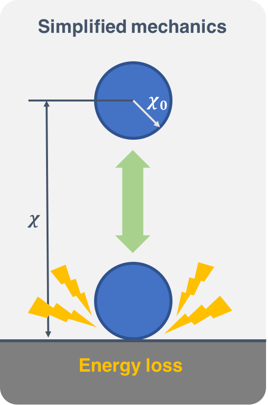
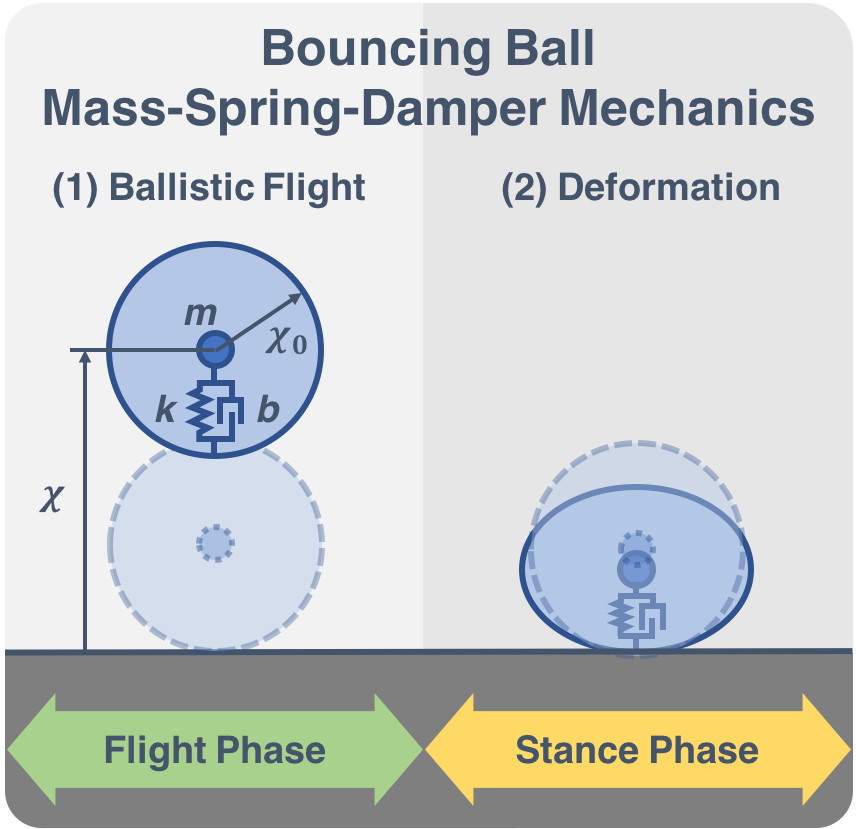
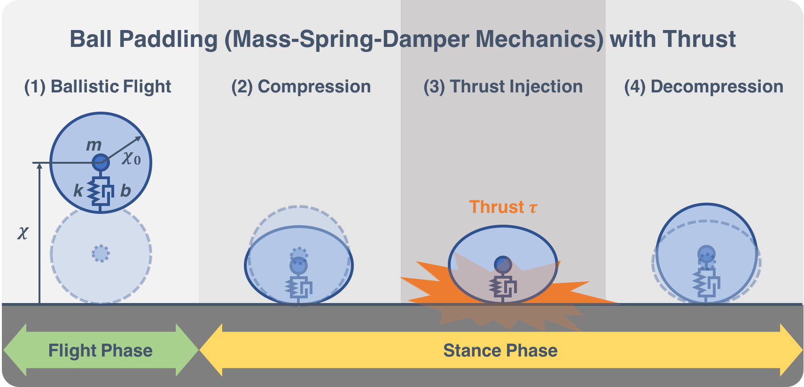
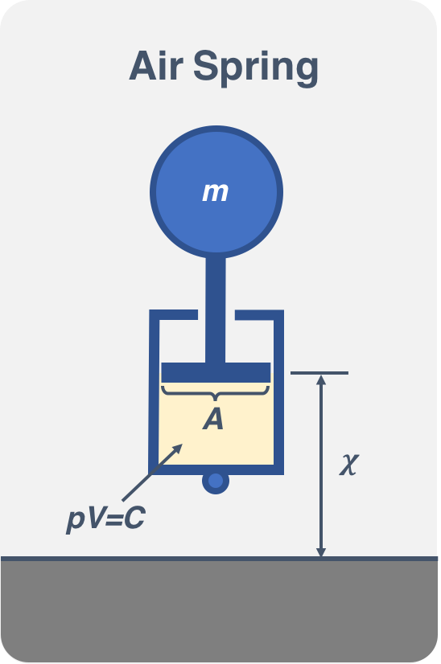
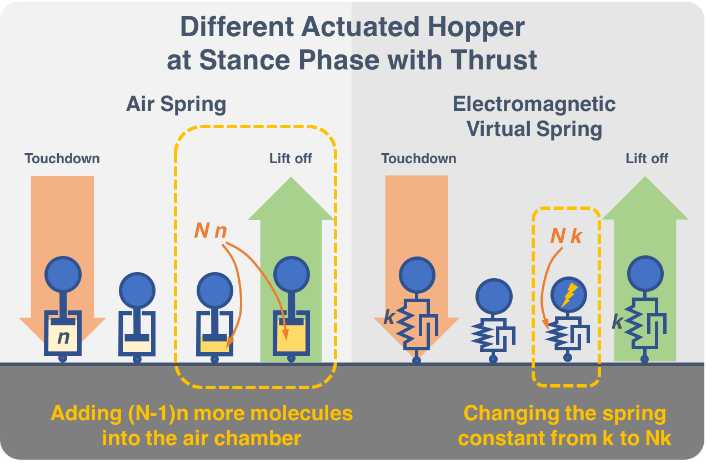
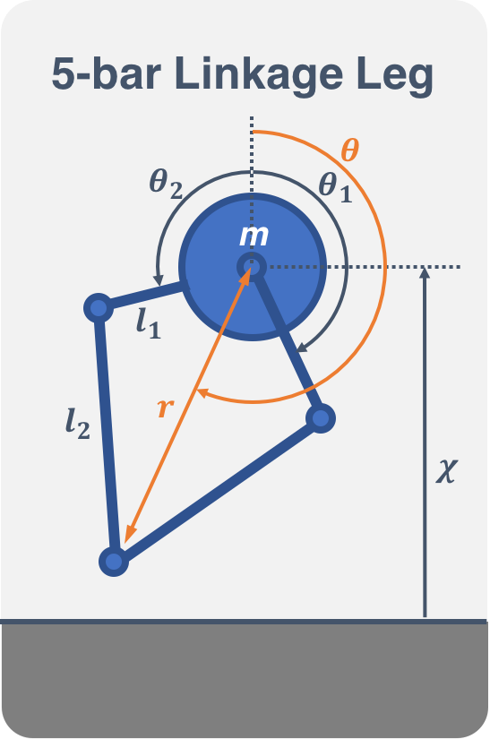

# From Bouncing Ball to Stable Hopper

## Part 1 Build a Bouncing Ball Simulation

### Simplified Mechanics of a Bouncing Ball
Let us start with a very simple bouncing ball problem. We want to simulate the bouncing motion of an elastic ball when it falls freely from a given height. We know that the ball has ballistic dynamics in its flight phase; the compression and release phases on the ground behaves like a mass-spring-damper system. Typically, this is not an easy problem, and by this we mean we cannot solve it analytically and there is no closed form solution. 
 

We release an elastic ball with radious $\chi_0 = 0.005$ (m) and as mass $m = 1$ (kg) from a height $h = 1$ (m), and the total energy of the ball at this initial point is $E$. If we don't have a damper in our system, we won't see any decrements in energy and the ball will bounce forever. Here, we will make the naive assumption that the ground consumes a certain portion of energy every time the ball hits it, returning only a portion (elastic efficiency $\gamma = 0.8$) of the previous energy $E_1$, that is $E_2 = \gamma E_1$, where $E_2$ is the new system energy after the collision. We also assume the collision happens in an instance and doesn't take any time at all, thus the deformation during that time is neglected.

In the Part1 folder we use ODE45 to solve the equation of motion numerically and plot the solution with respect to time. For simplicity of symbolic typing, we use Q, q, dq to represent $x$, $\chi$ $\dot{\chi}$.

### Mass-Spring-Damper Mechanics of a Bouncing Ball
Now, let's revisit the bouncing ball problem in a more sophisticated matter. Remember that our ball exhibits ballistic behavior (1) in its flight phase, and behaves like a mass-spring-damper system (2) in the stance phase, where $\chi_0 is the rest length (equivalent to the ball radius) of the modeled spring, $k$ is the spring constant of the modeled spring and $b$ is the viscous damping coefficient of the modeled damper.
- 1. $m\ddot{chi} = -mg$
- 2. $m\ddot{chi} + b\dot{chi} + k(\chi - chi_0) = -mg$
 

Given the properties of the ball: mass $m =1$ (kg), rest length $\chi_0 = 0.05$ (m), the spring constant $k = 70000$ (N/m), viscous damping coefficient $b = 15$ (N s/m), the script in the part 1 solves the equations of motion and plot the solution with respect to time.

### Padding (Juggling) a Ball
We have now found out the motion of a bouncing ball when it is let loose from a given height. Due to the damper consuming energy in the system, the ball will eventually stop bouncing. Thus if we want to make the ball bounce forever, we could inject some energy into the system to compensate for those that are consumed from the damper. 
Imagine you are paddling the elastic ball upward with a flat solid paddle. Suppose that you are a professional and you manage to have the ball touch down at the same position, and once the center of mass of the ball is at its exact lowest point, you provide a constant uniform force throughout the rest of the collision until the ball takes off at the same height it touches down every time. Since we are now actively providing energy into the system, i.e., the work done by the force transmitted to the ball via the paddle, we can imagine that the ball will eventually bounce at a constant height, and it would go on forever if we provide the energy it needs nonstop. 
The script in the Part 1 folder solves the equation of motion and plots the solution with respect to time, assuming that $\tau = 120$ (N) for a sufficient time $\delta = 0.005$ (sec). 

## Part 2 Build a Hopper Simulation

### Active Hopper with Different Controller
From now on, we will leave the bouncing ball with a paddle problem and look at a pogo stick. Surprisingly, the equations of motion that describe the two systems are the same. The main difference between the bouncing ball with a paddle problem and the pogo stick problem is that we will inject the energy through an actuator attached on the system, whereas the energy was injected through the ground then to the system. When using a pogo stick, people can use their leg muscles to generate or dissipate energy. Exercising muscle is the most common actuator in living being, whereas in the artificial world, actuators can be motors, linear actuators, pneumatic actuators, etc. 
 
One common way to assemble a pogo stick uses a linear (coil) spring or a pneumatic spring. The pneumatic spring usually provides more force to the system than a linear spring and is often used in tasks requiring higher loading. In contrast, a linear spring is more sensitive (higher bandwidth) and is generally used for more agile tasks. Due to the different mechanisms, the control strategies are quite different as well. Here we will simulate a few actuator models for our control input $u(x,t)$ for the different mechanisms.

#### Case 1. Linear Spring with Linear Actuator
One of the two common pogo sticks uses linear spring. Assume that in addition to the original mass-spring-damper system, we have a linear actuator attached and in parallel to the spring-damper. This theoretical linear actuator is weightless and generates torque as desired. Assume that the liner actuator provides a constant force $\tau$ for only $\delta = 0.005$ (sec) starting at the bottom of the stance phase, and it follows that our control law looks exactly like the ball-paddling problem. 
Given the hopper specifications: mass $m = 3$(Kg), rest length $\chi_0 = 0.3$(m), the spring constant $k = 5000$(N/m), viscous damping coefficient $b = 6$(N s/m), the script in Part2/Part2-1/Case1 simulates the control strategy to maintain the hopper at the same height $h = 1$(m) witha rasonable torque.

#### Case 2. Pneumatic Actuator
Another common pogo stick assembly uses a pneumatic spring. A pneumatic spring achieves its springiness by compressing either air or other fluids. Assume that the gas in the pneumatic spring is ideal and the temperature does not change during the compression. Then, according to Boyle's law, the product of the pressure and the volume is constant, that is, $pV = C$. 
 
Given the hopper specifications: mass $m = 3$(Kg), rest length $\chi_0 = 0.3$(m), the air-spring constant $k = 60$(N.m), viscous damping coefficient $b = 6$(N s/m), the script in Part2/Part2-1/Case2 simulates the control strategy to maintain the hopper at the same height $h = 1$(m) witha rasonable inflating constant $N$.

#### Case 3. Electromagnetic Virtual Spring
From the previous pneumatic model, we can see how convenient it would be to have a hopper with a controllable stiffness. The dynamic of the system can be easily represented as $\dot{x} = f(x, N)$. In the real world, the implementation of a pneumatic spring is difficult due to the fact that a pneumatic pump is heavy and bulky. Assume that there is a way we could control the stiffness of a Hooke-law spring; in fact, assume that we can construct a virtual Hooke-law spring via an electromagnetic actuator. Then, by manipulating the spring constant, we should be able to control the hopper, making it jump as desired. 
 
Given the hopper specifications: mass $m = 3$(Kg), rest length $\chi_0 = 0.3$(m), the air-spring constant $k = 60$(N.m), viscous damping coefficient $b = 6$(N s/m), the script in Part2/Part2-1/Case3 simulates the control strategy to maintain the hopper at the same height $h = 1$(m) witha rasonable proportional control variable $N$.

### Active Five-bar-linkage Leg
Until now, we have been looking at a very simple version of a hopper. This simple mass-spring-damper model is what we call a "template" of a hopper. A template is the simplest model that exhibits a targeted behavior. We can now try to embed more joints and actuator into the system, like what a leg really could look like. This action is called anchoring, and the reason for anchoring could be that we want to add more actuator to strengthen the system or to make a system more realizable. In the case of the Electromagnetic Virtual Spring model hopper mentioned in the last chapter, it is hard to realize due to the fact that linear actuators are slow and bulky, thus we will anchor this design to a more applicable mechanism. 
 
Given the hopper specifications: mass $m = 3$(Kg), rest length $\chi_0 = 0.3$(m), the air-spring constant $k = 60$(N.m), viscous damping coefficient $b = 6$(N s/m), the script in Part2/Part2-2 simulates the control strategy.
