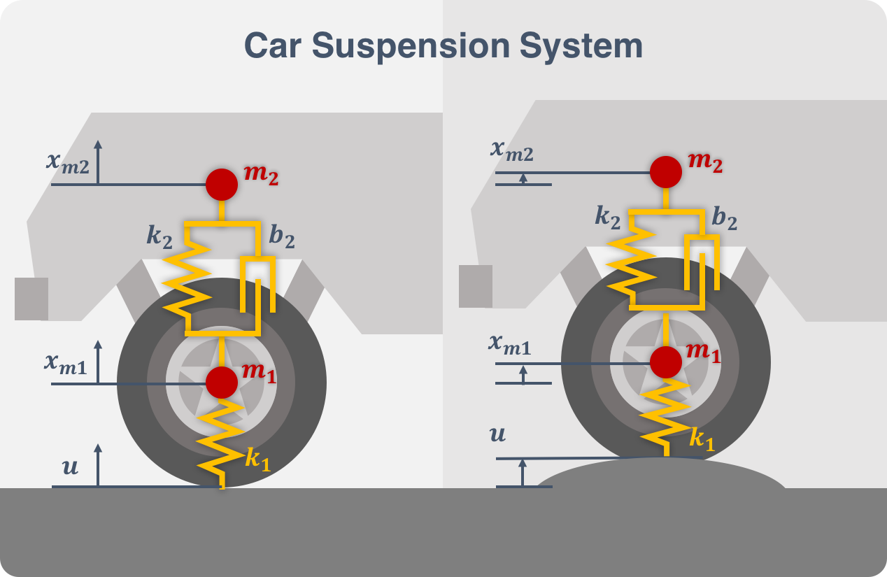

# A Vertical Hopping Controller - Car Suspension System

 
While 1DOF harmonic oscillators and pendula are the basic building blocks of legged locomotion controllers, they can be used as the basic building blocks for other real world control systems as well. In this lab we look at a spring-spring-mass-damper system that models the suspension of a car, and we see that based on the mass of the chassis and wheels/axles, we can tune our springs to force the desired behavior. 
The equations of motion are coded and the system is simulated in the script *carSuspension.m*.
